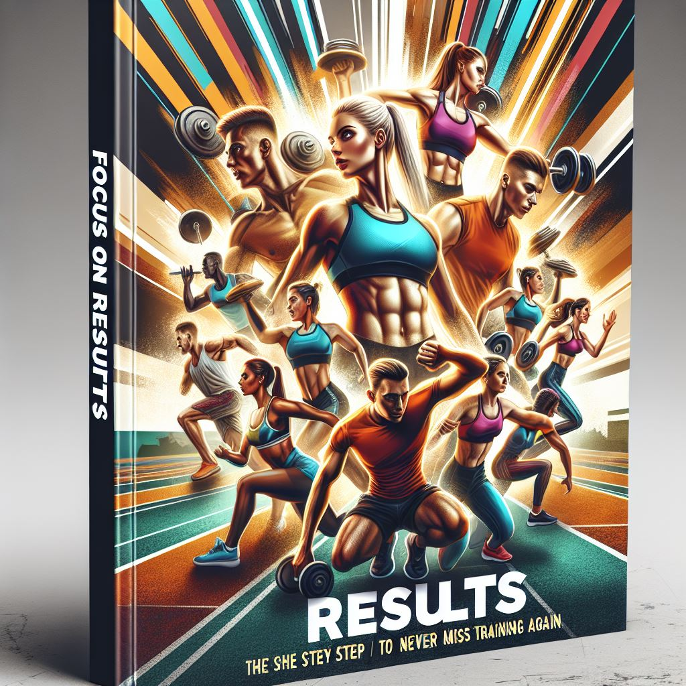

<h2 align="center">
    Foco no resultado: O passo a passo para nunca mais faltar no treino
    

</h2>

# Projeto EBOOK Gerado por I.A.s

Projeto com o objetivo de gerar um ebook digital com as facilidades das ferramentas de IA.

## 💻 Tecnologias utilizadas no projeto

- [ChatGPT](https://chat.openai.com/) 
- [Copilot](https://copilot.microsoft.com/)
- [PowerPoint](https://www.microsoft.com/en/microsoft-365/powerpoint)

## ✨ Como foi feito ?

- Roteiro gerado via chatgpt
- Copilot para gerar capas
- Power point para organizar os materias e criar o ebook
